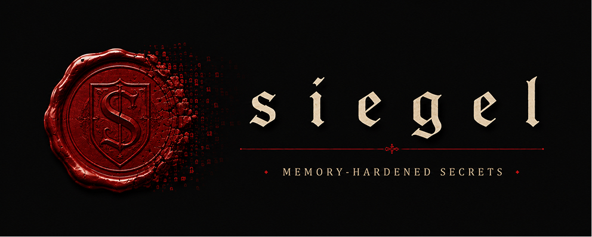

> [!WARNING]  
> This code is currently **UNAUDITED**. Please be careful with any use.

# 🧧siegel

> Siegel from the german word for seal

Siegel is a simple package that offers best-effort protected memory allocation for loading and using secrets.

Please see the [main `siegel` README](siegel/README.md).

## Motivation

Loading secrets into memory always comes with risks. Using hardware-backed secure elements (e.g. Apple's [Secure Enclave](https://support.apple.com/guide/security/the-secure-enclave-sec59b0b31ff/web)) will provide better security and should be used where possible. However, not all use cases can leverage devices' secure elements. Some examples include:
- Unsupported curves (e.g. curve `secp256k1` is currently unsupported on iOS).
- Unsupported operations (e.g. specific hashing functions, key derivation functions).

For these use cases, Siegel provides a type-safe mechanism to loaad secrets into application memory and perform operations with them. 

Siegel particularly focuses on secrets that must cross foreign boundaries. For example, if you have a zero-knowledge proof system relying on a secret stored in the device's keychain but the specific operations must be performed on the Rust side.

## Documentation

See [docs.rs](https://docs.rs/siegel)
